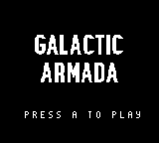
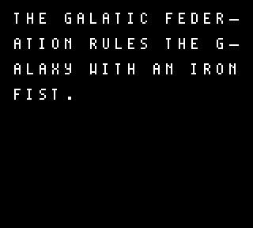
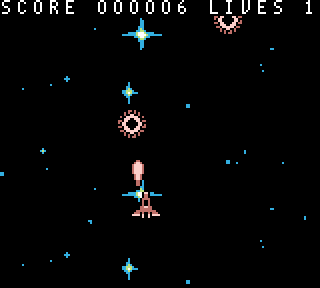

# Galactic Armada

The galactic federation rules the galaxy with an iron fist. The rebel force remainhopeful of freedom's dying light. This is a basic gameboy shmup for RGBDS. More info can be found here: https://rgbds.gbdev.io/. A guide will be created to show developers how to create their own SHMUP, you can find that guide here: (https://gbdev.io/gb-asm-tutorial/index.html)[https://gbdev.io/gb-asm-tutorial/index.html]

This demo utilizes assembly, for those not familiar (or willing to embark on the painful journey of learning as they go), check out [GBDK-2020](https://github.com/gbdk-2020/gbdk-2020). GBDK-2020 is a C library also for making gameboy games. I've also written a series of [GBDK tutorials on my website.](https://laroldsjubilantjunkyard.com/tutorials/how-to-make-a-gameboy-game/) 

## Feature set
Here’s a list of features that will be included in the final product.

- Vertical Scrolling Background
- Basic HUD (via Window) & Score
- 4-Directional Player Movement
- Enemies
- Bullets
- Enemy/Bullet Collision
- Enemy/Player Collision
- Smooth Movement via Scaled Integers - Instead of using counters, smoother motion can be achieved using 16-bit (scaled) integers.
- Multiple Game States: Title Screen, Gameplay, Story State
- STAT Interrupts - used to properly draw the HUD at the top of gameplay.
- RGBGFX & INCBIN
- Writing Text

## To Install

Install RGBDS tools found here: https://rgbds.gbdev.io/install/. You can either use a pre-built version, if one is available for your operating system; or you can build RGBDS from source.

Run `Make`

## To Run

Open .gb file with a gameboy emulator:
 - https://mgba.io/
 - https://emulicious.net/
 - https://bgb.bircd.org/

> If you want to "Debug" your games, check out '[Emulicious](https://emulicious.net/)'